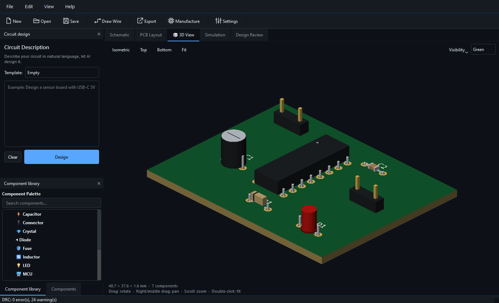
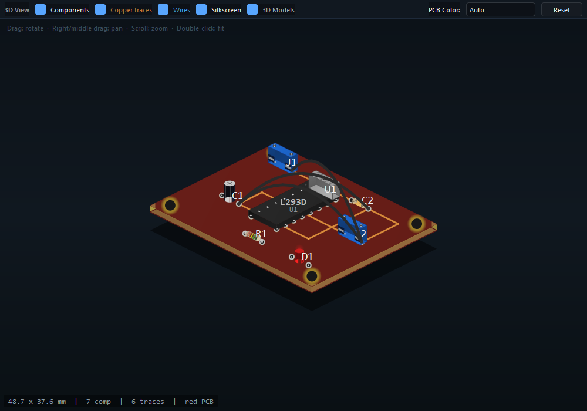
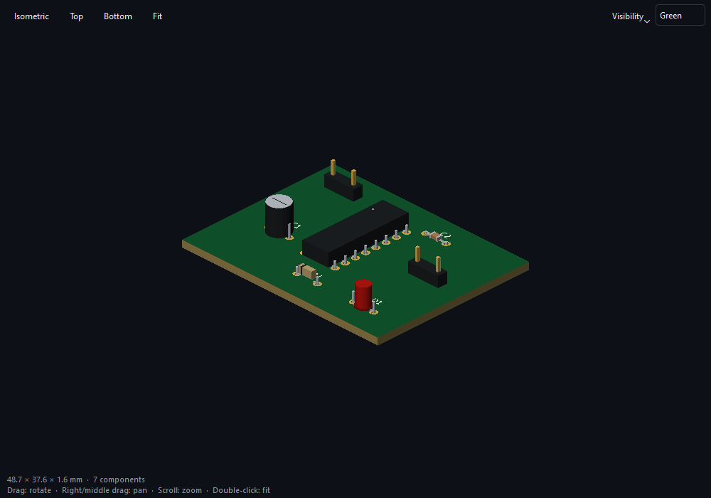

<p align="center">
  
</p>

<h1 align="center">🚀 AI PCB Generator</h1>

<p align="center">
  <strong>The world's first fully AI-powered, open-source PCB design suite.</strong><br/>
  From natural language to production-ready PCBs — in minutes, not weeks.
</p>

<p align="center">
  <em>Describe your circuit in plain English or Turkish → AI generates the full schematic → auto-places components → routes traces → simulates the circuit → runs DFM analysis → exports Gerber files → orders from JLCPCB with one click.</em>
</p>

<p align="center">


[](https://buymeacoffee.com/otis21)

</p>

---

## 🌟 Why AI PCB Generator?

Traditional PCB design takes **days or weeks** — you need to learn complex EDA tools, manually draw schematics, place components, route traces, run checks, and generate manufacturing files.

**AI PCB Generator does all of this in under 5 minutes.** Just describe what you want in plain text, and the AI handles everything from circuit design to production-ready output.

> 💬 *"Design a motor driver board with L298N, 12V input, 5V regulator, PWM headers, and flyback diodes"*
>
> ⚡ **Result:** Complete schematic + PCB layout + 3D view + SPICE simulation + DFM analysis + Gerber ZIP — ready to order.

---

## ✨ Key Features

### 🧠 AI-Powered Circuit Design
Type a description in **natural language** and the AI generates a complete circuit specification — components, pin connections, net assignments, footprints, and placement. Supports **OpenAI GPT-4o**, **Google Gemini**, **Anthropic Claude**, or any OpenAI-compatible API.

### 📐 Interactive Drag & Drop Schematic Editor
Full-featured schematic editor with **drag-and-drop** component placement, **real-time wire drawing**, undo/redo, and a searchable component palette with 18+ categories. Edit AI-generated designs or build from scratch.

### 🤖 AI Co-Pilot with ERC Engine
Built-in **Electrical Rules Check** with 8 automated rules — unconnected power pins, missing resistors on LEDs, no ground, multiple output conflicts, missing decoupling capacitors, and more. Smart **pin alias matching** (VIN↔IN, GND↔VSS) eliminates false positives.

### ⚡ Real-Time SPICE Simulation
Simulate your circuit **before manufacturing** with integrated **NgSpice 46** support:
- **DC Operating Point** — Node voltages and branch currents
- **Transient Analysis** — Time-domain waveforms
- **AC Frequency Sweep** — Bode plots and frequency response
- **DC Sweep** — Transfer characteristics

Built-in **MNA (Modified Nodal Analysis) solver** works even without NgSpice installed — no external tools required for basic simulations.

### 🔍 AI Design Review & DFM Analysis
**12 manufacturing-focused checks** powered by industry standards (IPC-2221):

| Check | Description |
|-------|-------------|
| DFM-001 | Power trace current capacity validation |
| DFM-002 | Annular ring verification (via & pad) |
| DFM-003 | Acid trap detection (acute-angle junctions) |
| DFM-004 | Thermal relief recommendations |
| DFM-005 | Silkscreen over pad detection |
| DFM-006 | Component spacing for pick-and-place |
| DFM-007 | Board dimension validation |
| DFM-008 | Via aspect ratio check |
| DFM-009 | Copper balance analysis |
| DFM-010 | Solder bridge risk detection |
| DFM-011 | Minimum drill size verification |
| DFM-012 | Differential pair length mismatch |

Each issue comes with a **0-100 manufacturability score**, severity rating (Critical/Warning/Info), and actionable **fix recommendations**.

### 🏭 One-Click PCB Manufacturing
Go from design to **production order** with a single click:

- **Manufacturer Profiles** — JLCPCB, PCBWay, OSH Park with real capability limits
- **Live Cost Estimation** — PCB cost + SMT assembly breakdown, updated as you change quantity
- **Production Package** — Generates everything you need:
  - 📦 **Gerber ZIP** — Ready to upload to any manufacturer
  - 📋 **BOM CSV** — JLCPCB-compatible Bill of Materials
  - 📍 **Pick & Place CPL** — Component placement for SMT assembly
  - 🔧 **KiCad PCB** — For further editing in KiCad
- **Lead Time Display** — Know exactly when your boards will arrive
- **Capability Validation** — Warns if your design exceeds manufacturer limits

### 🖥️ Professional 3D PCB Viewer
The viewer uses `QOpenGLWidget` and PyOpenGL with depth testing, directional
lighting, multisample antialiasing (when supported by the driver), and
orthographic top, bottom and isometric inspection views.

- Board dimensions, thickness, pads, drill openings, vias and front/back traces
  come from the current board data. No decorative mounting holes or copper pours
  are added. Internal copper layers are not exposed in this surface viewer.
- Package-aware built-in bodies work without KiCad. Matching KiCad `.wrl` models
  retain their footprint origin, convert 0.1-inch units to millimetres, and apply
  component rotation and back-side placement. Ambiguous connector models use a
  built-in approximation.
- **Visibility** controls components, traces, reference markings, KiCad models
  and unrouted connection guides. Guides are off by default and appear as straight
  lines rather than physical jumper wires.
  Newly generated boards currently contain unrouted guides; copper traces appear
  after routing has produced physical trace segments.
- Left drag rotates; right/middle drag pans; scrolling zooms around the pointer.
  Double-click or **Fit** frames the board. **Top**, **Bottom** and **Isometric**
  provide preset views. The existing zoom menu actions also work in the 3D tab.
- If imports, context creation or drawing fail, a status message identifies the
  software preview. It preserves the previous isometric renderer with simpler
  depth handling and model placement than the OpenGL renderer.



The AI input, component library and BOM are independent dock panels: close them
to enlarge the workspace and reopen them from **View**. Library and BOM panels
share tabs by default. Both light/dark themes and live Turkish/English switching
are supported; the toolbar uses theme-aware line icons.

| Before: software isometric renderer | After: depth-tested OpenGL renderer |
| --- | --- |
|  |  |

The comparison uses the same synthetic motor-driver board, physical camera
orientation and pixel scale. This fixture is for visual verification, not an
electrically validated manufacturing design. Built-in bodies are approximate;
the viewer does not repair footprint/pad inaccuracies in the board generator.

### 🔧 PCB Layout Engine
- KiCad-quality **EDA-style** layout rendering
- Grid-based auto-placement with intelligent grouping
- **Freerouting** integration for automatic trace routing
- Layer support (F.Cu, B.Cu, inner layers)
- Real-time **DRC** (Design Rule Check) with pad clearance, trace width, via drill validation

### 📦 Multi-Format Export
- **KiCad** `.kicad_pcb` — Open directly in KiCad 9.0
- **Gerber** RS-274X + Excellon drill — Standard manufacturing format
- **SVG** — High-quality vector graphics
- **JSON** — Full circuit data for automation

> Export fix (March 17, 2026): Gerber silkscreen export now derives component body bounds from pad geometry, resolving the `'PlacedComponent' object has no attribute 'width_mm'` crash seen during exports such as Arduino Uno Shield.

### 🛠️ Bundled Vendor Tools
All critical tools come **pre-bundled** — no separate installation needed:

> Freerouting fix (March 17, 2026): Production file generation now falls back to the internal A* router when Freerouting fails or produces no SES output, instead of aborting the manufacturing/export workflow.

| Tool | Version | Status |
|------|---------|--------|
| NgSpice | 46 | ✅ Bundled in `vendor/` |
| Freerouting | 2.1.0 | ✅ Bundled in `vendor/` |
| KiCad | 9.0 | 🔍 Auto-detected |

Run `python setup_vendor.py` to download vendor tools automatically.

### 🌐 Multi-Language & Theming
- Full **Turkish** and **English** UI
- **Dark** and **Light** themes
- Live language switching — no restart needed

---

## 🏗 Architecture

```
  User Input (Natural Language)
          │
          ▼
  ┌─────────────────┐
  │   AI Engine      │  GPT-4o / Gemini / Claude / Any LLM
  │   (OpenAI API)   │
  └────────┬────────┘
           │  CircuitSpec (Pydantic JSON)
           ▼
  ┌─────────────────┐     ┌──────────────────┐
  │  Schematic       │────▶│  AI Co-Pilot     │
  │  Editor          │     │  (8 ERC Rules)   │
  └────────┬────────┘     └──────────────────┘
           │
           ▼
  ┌─────────────────┐     ┌──────────────────┐
  │  PCB Generator   │────▶│  DRC Engine      │
  │  + Auto-Router   │     │  (6 Checks)      │
  └────────┬────────┘     └──────────────────┘
           │
           ▼
  ┌─────────────────┐     ┌──────────────────┐
  │  SPICE Simulator │     │  DFM Analysis    │
  │  (NgSpice/MNA)   │     │  (12 Checks)     │
  └────────┬────────┘     └────────┬─────────┘
           │                       │
           ▼                       ▼
  ┌─────────────────────────────────────────┐
  │         Production Output               │
  │  Gerber ZIP │ BOM CSV │ CPL │ KiCad PCB │
  └──────────────────┬──────────────────────┘
                     │
                     ▼
  ┌─────────────────────────────────────────┐
  │     One-Click Manufacturing             │
  │  JLCPCB  │  PCBWay  │  OSH Park        │
  └─────────────────────────────────────────┘
```

---

## 📋 Requirements

| Software | Version | Required? | Description |
|----------|---------|-----------|-------------|
| **Python** | 3.10+ | ✅ Required | Core runtime |
| **AI API Key** | — | ✅ Required | OpenAI, Gemini, Claude, or compatible |
| **KiCad** | 9.0+ | ⚡ Recommended | 3D models & advanced export |
| **Java** | 11+ | 🔧 Optional | For Freerouting auto-routing |
| **NgSpice** | 45+ | 📦 Bundled | SPICE simulation (auto-downloaded) |
| **Freerouting** | 2.1+ | 📦 Bundled | Auto-routing (auto-downloaded) |

---

## 🚀 Installation

### 1. Clone the repository
```bash
git clone https://github.com/22507260/AI-PCB-Generator.git
cd AI-PCB-Generator
```

### 2. Create virtual environment & install
```bash
python -m venv venv

# Windows
venv\Scripts\activate

# macOS/Linux
source venv/bin/activate

pip install -r requirements.txt
```

### 3. Download vendor tools (NgSpice + Freerouting)
```bash
python setup_vendor.py
```

### 4. Configure API Key
```bash
copy .env.example .env    # Windows
# cp .env.example .env    # macOS/Linux

# Edit .env and add your AI API key:
# OPENAI_API_KEY=sk-...
```

### 5. Launch
```bash
python main.py
```

---

## 📖 Usage

### ⚡ Quick Start (5-Step Workflow)

1. **Describe** — Type your circuit in the left panel:
   ```
   Design a sensor board with USB-C 5V input,
   3.3V LDO regulator, 3 status LEDs and I2C header.
   ```
2. **Generate** — Click **⚡ Design** → AI creates the full schematic
3. **Simulate** — Switch to **⚡ Simulation** tab → Run DC/Transient/AC analysis
4. **Review** — Check the **🔍 Design Review** tab → Fix any DFM issues
5. **Manufacture** — Click **🏭 Manufacture** → Generate Gerber ZIP + BOM + CPL → Order

### 🎯 Built-in Templates

| Template | Description |
|----------|-------------|
| 💡 LED Circuit | Simple LED + current-limiting resistor |
| 🔋 Voltage Regulator | 12V → 5V → 3.3V with bypass capacitors |
| 🎮 Arduino Shield | 2 buttons + 3 LEDs + I2C + potentiometer |
| 🌡️ Sensor Module | I2C temperature/humidity + 3.3V regulator |
| ⚙️ Motor Driver | L298N dual H-bridge + PWM + flyback diodes |
| 🔌 USB-C Power | USB-C input + ESD + polarity protection |

### ⌨️ Keyboard Shortcuts

| Shortcut | Action |
|----------|--------|
| `Ctrl+N` | New Project |
| `Ctrl+O` | Open Project |
| `Ctrl+S` | Save Project |
| `Ctrl+E` | Export (KiCad/Gerber/SVG/JSON) |
| `Ctrl+M` | One-Click Manufacture |
| `Ctrl+Z` | Undo |
| `Ctrl+Y` | Redo |
| `Ctrl+,` | Settings |

---

## 📁 Project Structure

```
AI-PCB-Generator/
├── main.py                         # Application entry point
├── setup_vendor.py                 # Vendor tool downloader (NgSpice, Freerouting)
├── requirements.txt                # Python dependencies
├── src/
│   ├── app.py                      # QApplication bootstrap
│   ├── config.py                   # Settings (pydantic-settings + .env)
│   ├── vendor.py                   # Vendor tool auto-discovery
│   ├── ai/
│   │   ├── schemas.py              # Pydantic data models (CircuitSpec, etc.)
│   │   ├── client.py               # LLM API wrapper (OpenAI-compatible)
│   │   ├── prompts.py              # System prompts + few-shot examples
│   │   └── parser.py               # AI output validation & repair
│   ├── pcb/
│   │   ├── generator.py            # Board generation + auto-placement
│   │   ├── router.py               # Freerouting integration
│   │   ├── exporter.py             # KiCad / Gerber / SVG / JSON export
│   │   ├── rules.py                # DRC engine (6 design rule checks)
│   │   ├── dfm.py                  # DFM analysis engine (12 checks)
│   │   ├── manufacturing.py        # One-Click manufacturing pipeline
│   │   └── components.py           # Component database
│   ├── simulation/
│   │   ├── engine.py               # NgSpice + built-in MNA solver
│   │   └── netlist.py              # SPICE netlist generator
│   ├── gui/
│   │   ├── main_window.py          # Main window (6-tab layout)
│   │   ├── input_panel.py          # AI input + template selector
│   │   ├── schematic_view.py       # Drag & Drop schematic editor
│   │   ├── pcb_view.py             # KiCad-quality PCB layout viewer
│   │   ├── view3d.py               # 3D PCB viewer (VRML/OpenGL)
│   │   ├── simulation_view.py      # SPICE simulation UI + plots
│   │   ├── ai_copilot.py           # AI Co-Pilot + ERC engine
│   │   ├── design_review.py        # DFM analysis panel + scoring
│   │   ├── manufacturing_dialog.py # One-Click manufacturing dialog
│   │   ├── component_panel.py      # BOM table
│   │   ├── component_palette.py    # Drag & Drop component palette
│   │   ├── export_dialog.py        # Multi-format export dialog
│   │   ├── settings_dialog.py      # Settings + tool status
│   │   ├── i18n.py                 # Turkish/English translations
│   │   └── theme.py                # Dark/Light theme engine
│   ├── models/
│   │   ├── model_registry.py       # KiCad 3D model mapping
│   │   └── vrml_parser.py          # VRML 2.0 mesh parser
│   └── utils/
│       ├── logger.py               # Structured logging
│       ├── file_io.py              # Project save/load (.apcb)
│       └── validators.py           # Input validation
├── vendor/                         # Bundled tools (auto-downloaded)
│   ├── Spice64/                    # NgSpice 46
│   └── freerouting-2.1.0.jar      # Freerouting
├── data/
│   └── templates/                  # Built-in circuit templates
├── assets/                         # Icons, fonts, styles
└── tests/                          # Unit & integration tests
```

---

## 🧪 Testing

```bash
pip install -e ".[dev]"
pytest
```

Geometry, camera, dock controls, translations and software fallback have automated
coverage. A desktop OpenGL smoke test checks a rendered framebuffer; it skips on
the `offscreen` / `minimal` Qt platforms or when no context is available.
Headless CI can run `QT_QPA_PLATFORM=offscreen pytest` (PowerShell:
`$env:QT_QPA_PLATFORM='offscreen'; pytest`).

To regenerate LED, voltage regulator, motor-driver, bottom-view and workspace
screenshots on a desktop with OpenGL, without an API key or KiCad:

```bash
python tools/capture_pcb_workspace.py
```

The capture tool fails if OpenGL falls back. Images go to `assets/screenshots/`;
the before image uses the pinned pre-change renderer from commit `9eae9db`.
Open `data/examples/led_circuit.apcb` or `data/examples/voltage_regulator.apcb`
via **File → Open** to inspect a sample without calling an AI provider.
The accelerated viewer requires OpenGL 2.1 compatibility support. STEP import
and ray tracing are not included.

---

## 📊 Feature Comparison

| Feature | AI PCB Generator | KiCad | EasyEDA | Altium |
|---------|:---------------:|:-----:|:-------:|:------:|
| AI Natural Language Design | ✅ | ❌ | ❌ | ❌ |
| Drag & Drop Schematic | ✅ | ✅ | ✅ | ✅ |
| SPICE Simulation | ✅ | ✅ | ❌ | ✅ |
| DFM Analysis (12 checks) | ✅ | ❌ | ❌ | ✅ |
| One-Click Manufacturing | ✅ | ❌ | ✅ | ❌ |
| AI Co-Pilot (ERC + fixes) | ✅ | ❌ | ❌ | ❌ |
| 3D PCB Viewer | ✅ | ✅ | ✅ | ✅ |
| Cost Estimation | ✅ | ❌ | ✅ | ❌ |
| Open Source | ✅ | ✅ | ❌ | ❌ |
| Free | ✅ | ✅ | ⚠️ | ❌ |

---

## 🤝 Contributing

1. Fork the repository
2. Create a feature branch (`git checkout -b feature/awesome-feature`)
3. Commit your changes (`git commit -m 'feat: add awesome feature'`)
4. Push the branch (`git push origin feature/awesome-feature`)
5. Open a Pull Request

---

## 📄 License

MIT License — see the [LICENSE](LICENSE) file for details.

---

<p align="center">
  <strong>Built with ❤️ using Python, PySide6/Qt6, and AI</strong><br/>
  <sub>Star ⭐ this repo if you find it useful!</sub><br/><br/>
  <a href="https://buymeacoffee.com/otis21">
    
  </a>
</p>
